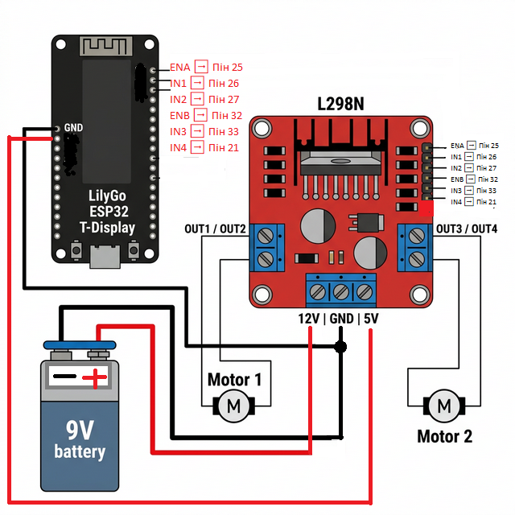

# Проект: Покращений пульт та машинка на ESP32

Цей проект дозволяє керувати машинкою через ESP-NOW, використовуючи дві плати LilyGo T-Display та драйвер L298N.

## Основні зміни
- **4 кнопки керування**: Вперед, Назад, Ліворуч, Праворуч.
- **PWM (ШІМ)**: Плавне керування швидкістю моторів (0-255).
- **Failsafe**: Якщо сигнал від пульта зникає на більше ніж 0.5с, машинка автоматично зупиняється.
- **Покращений інтерфейс**: На екранах обох плат відображається статус з'єднання та активні команди.

## Структура проекту
- [common.h](file:///d:/ProjectsESP32/Pult-remoute-control/sender/common.h) — Спільна структура даних.
- [sender.ino](file:///d:/ProjectsESP32/Pult-remoute-control/sender/sender.ino) — Код для пульта.
- [resiver.ino](file:///d:/ProjectsESP32/Pult-remoute-control/resiver/resiver.ino) — Код для машинки.

## Підключення (Pinout)



### Схема з'єднання L298N та ESP32:
| ESP32 Пін | Драйвер L298N | Опис |
| :--- | :--- | :--- |
| **25** | **ENA** | Швидкість (PWM) Мотора 1 |
| **26** | **IN1** | Напрямок 1 Мотора 1 |
| **27** | **IN2** | Напрямок 2 Мотора 1 |
| **32** | **ENB** | Швидкість (PWM) Мотора 2 |
| **33** | **IN3** | Напрямок 1 Мотора 2 |
| **21** | **IN4** | Напрямок 2 Мотора 2 |
| **GND** | **GND** | Спільна "земля" |


### Пульт (Sender)
| Кнопка | Пін ESP32 |
| :--- | :--- |
| Вперед | 27 |
| Назад | 26 |
| Ліворуч | 25 |
| Праворуч | 33 |

### Машинка (Receiver)
| Елемент | Пін ESP32 | Опис |
| :--- | :--- | :--- |
| Світлодіод | 12 | Загоряється при отриманні активного сигналу |
| ENA (PWM) | 25 | Швидкість мотора A (Задні колеса) |
| IN1 | 26 | Напрямок 1 мотора A |
| IN2 | 27 | Напрямок 2 мотора A |
| ENB (PWM) | 32 | Швидкість мотора B (Повороти) |
| IN3 | 33 | Напрямок 1 мотора B |
| IN4 | 21 | Напрямок 2 мотора B |

## Керування потужністю WiFi

Для стабільної роботи пульта та запобігання перезавантаженням через просідання напруги (Brownout), у коді `sender.ino` обмежено потужність передавача WiFi:

```cpp
WiFi.setTxPower(WIFI_POWER_11dBm);
```

### Доступні рівні потужності для ESP32:
- **Максимальна**: `WIFI_POWER_19_5dBm` (найбільша дальність, найбільше споживання струму).
- **Середня**: `WIFI_POWER_11dBm` (рекомендовано для стабільності).
- **Мінімальна**: `WIFI_POWER_2dBm` (найменше споживання, мала дальність).

### Як змінювати?
Використовуйте константи від `WIFI_POWER_19_5dBm` до `WIFI_POWER_2dBm`. Зменшення потужності допомагає, якщо плата перезавантажується під час відправки даних.

## Як запустити?

1.  **MAC-адреса**: Вам потрібно дізнатися MAC-адресу плати-ресивера і вписати її в [sender.ino](file:///d:/ProjectsESP32/Pult-remoute-control/sender/sender.ino) (рядок 9):
    ```cpp
    uint8_t broadcastAddress[] = {0xA0, 0xDD, 0x6C, 0x70, 0x8C, 0xD4};
    ```
2.  **Бібліотеки**: Переконайтеся, що у вас встановлені бібліотеки `TFT_eSPI` (налаштована під T-Display).
3.  **Прошивка**: Прошийте спочатку ресивер, а потім сендер.

## Перевірка
- При натисканні кнопок на пульті, на екрані має з'явитися напис "MOVE: FORWARD" тощо.
- На екрані ресивера статус має змінитися на "STATUS: CONNECTED".
- Якщо ви вимкнете пульт, ресивер покаже "STATUS: DISCONNECTED" і зупинить мотори.
